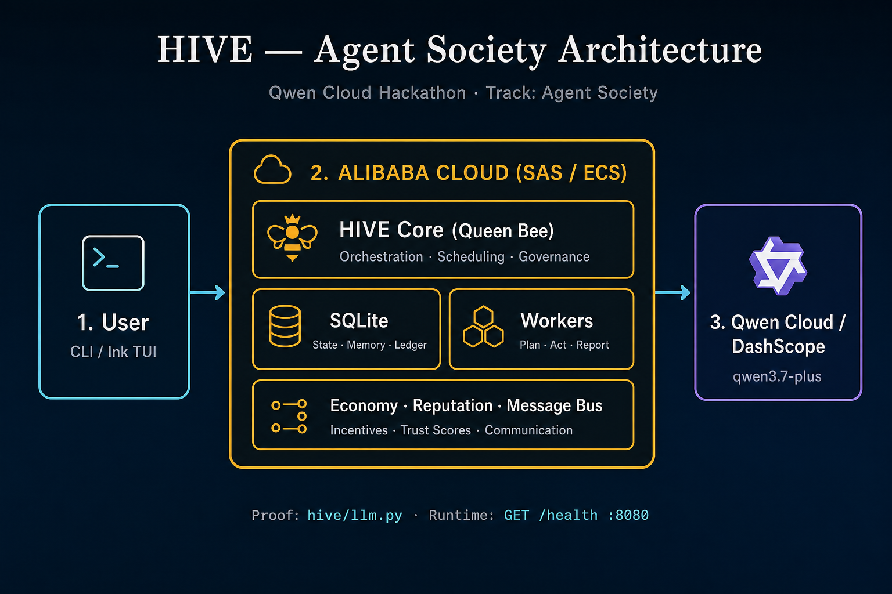

# HIVE — Agent Operating System

> **HIVE is an operating system where AI agents form temporary societies to solve problems.**

Just as bees form a hive to accomplish what no single bee can, HIVE spawns hierarchical agent societies that collaborate, debate, and self-organize around complex goals.

---

## The Central Thesis

**Every complex problem is a society waiting to form.**

Instead of programming a single AI to do everything, HIVE asks: *what kinds of minds would need to exist in a room to solve this?* It then assembles that society — and disassembles it when done.

This is the difference between a chatbot and an agent society:

| | Single Agent | HIVE Society |
|---|---|---|
| Handles complexity | By remembering everything | By distributing across specialists |
| Catches errors | Self-review | Cross-examination by 4+ agents |
| Makes high-stakes decisions | One opinion | Deliberated verdict |
| Adapts to new task types | Retrained / prompted | Creator spawns a new agent |
| Knows when to stop | Trust the model | Economy forces optimal resource use |
| Learns from failure | Implicit | Explicit reputation system |

---

## The Hive Metaphor

Every component maps to a hive function:

| Component | Hive Equivalent | Role |
|---|---|---|
| **HiveCore** | Queen Bee | Orchestrates, delegates, decides |
| **Agent Forge** | Brood Chamber | Creates and configures new agents |
| **Cleanup Crew** | Undertaker Bees | Retire agents, free memory, archive results |
| **Web Scout** | Scout Bees | Forage the web for information |
| **Security Scout** | Guard Bees | Patrol perimeter, detect threats |
| **Code Architect** | Builder Bees | Design elegant solutions |
| **Report Agent** | Scout Dancer | Communicates findings through clear patterns |
| **Data Analyst** | Scientist Bee | Analyzes, measures, finds patterns in data |
| **Diagnostician** | Surgeon Bee | Doesn't trust assumptions, probes deeply |
| **Red Team Agent** | Hunter Bee | Thinks like the enemy, attacks the plan |
| **GPU Tuner** | Engineer Bee | Optimizes, tunes, maintains efficiency |
| **Communicator** | Ambassador Bee | Speaks to the outside world |
| **Scheduler** | Clock Bee | Never misses a deadline |
| **Account Manager** | Guard Bee | Verifies identity, manages access |
| **Payment Agent** | Treasurer Bee | Precise, never loses a transaction |

---

## Architecture



User (CLI / Ink TUI) → **HIVE Core on Alibaba Cloud SAS/ECS** → SQLite + worker agents → **Qwen Cloud (DashScope)** for all LLM calls.

**Hackathon track:** Agent Society · **Deploy guide:** [DEPLOY.md](DEPLOY.md) · **Go-live checklist:** [docs/GO_LIVE.md](docs/GO_LIVE.md) · **Alibaba API proof:** [`hive/llm.py`](hive/llm.py)

<details>
<summary>Internal society layout (ASCII)</summary>

```
                    ┌──────────────────────────────┐
                    │          HIVE CORE            │
                    │         (Queen Bee)           │
                    │   Questions-first leader      │
                    │   1000 credits to spend       │
                    └──────────────┬─────────────────┘
                    ┌─────────────┼──────────────────┐
                    │             │                  │
            ┌───────┴───┐  ┌──────┴────┐  ┌────────┴───────┐
            │ Agent     │  │ Cleanup   │  │ Message Bus   │
            │ Forge     │  │ Crew      │  │               │
            │(Brood)    │  │(Undertaker│  │ agent ←→ agent│
            │           │  │ Bees)     │  │ communication │
            └───────────┘  └───────────┘  └───────────────┘
                    │
          ┌─────────┼─────────────────────────────┐
          │         │                             │
   ┌──────┴──┐ ┌───┴───┐ ┌────────┐ ┌──────────┐  ┌────┐
   │ Security│ │ Web   │ │ Architect│ │ Reporter │  │ ...│
   │ Scout   │ │ Scout │ │         │ │ Agent    │  │ 14 │
   │ Guard   │ │ Scout │ │ Builder │ │ Dancer   │  │    │
   └─────────┘ └───────┘ └────────┘ └──────────┘  └────┘
          │       │          │           │
          │       └──────────┼───────────┤
          │                  │           │
          │         ┌────────┴──────────┘
          │         │
          │   ┌─────┴─────┐
          │   │  Debate   │
          │   │  Protocol │
          │   │ Proposer  │
          │   │ Skeptic   │
          │   │ Architect │
          │   │ Guardian  │
          │   └───────────┘
          │         │
          │   ┌─────┴──────────┐
          │   │ Judge Verdict  │
          │   │ execute/escalate│
          │   │ /reject         │
          │   └────────────────┘
          │
    ┌─────┴──────────────────────────────────────┐
    │           Economy & Reputation              │
    │  Every agent: credits, energy, confidence   │
    │  Leader: budget allocator                  │
    │  Reputation: accuracy tracked over time     │
    └────────────────────────────────────────────┘
```

</details>

---

## Key Features

### 1. Dynamic Agent Society
Agents aren't fixed. The Creator can design a **new specialist agent** for a task, use it, then the Deletor archives it. The swarm adapts.

### 2. 4-Round Debate Protocol
Before any significant action, a structured debate runs:
- **Round 1**: Individual analysis (4 agents, no knowledge of others)
- **Round 2**: Cross-debate (respond to others' positions)
- **Round 3**: Refinement (revise based on challenges)
- **Round 4**: Negotiation (reach verdict or escalate)

### 3. Economy System
Every action costs credits. The Leader has a budget. This forces optimal resource allocation — spawn too many agents and you run out. Don't spawn enough and tasks fail.

### 4. Agent Emotions
Agents have emotional state: confidence, stress, load, trust. High stress triggers help-seeking. Low confidence triggers verification requests. The society self-regulates.

### 5. Reputation Affects Behavior
Architect accuracy 98% → Leader trusts them. Security accuracy 62% → Leader asks another agent to verify. Reputation changes how the society works.

### 6. Confidence on Every Result
No more "Done." Every result returns: `confidence` (84%), `reason` (why), `suggested_helper` (who to ask next).

### 7. Single vs Society Benchmark
For every significant action, HIVE compares: how would a single agent handle this? How does the swarm? The win rate is measurable.

---

## Running HIVE

```bash
pip install -e ".[browser]"   # or: pip install -r requirements.txt
playwright install chromium    # required for Playwright browser tools
# Optional: pip install browser-use  (Chrome-profile automation)

cp .env.example .env
# Edit .env — set DASHSCOPE_API_KEY (pay-as-you-go sk-... from home.qwencloud.com/api-keys)
python scripts/verify_qwen_key.py

python -m hive                 # interactive CLI
python -m hive.cli --server    # JSON-lines server for Ink frontend
python -m hive.deploy_server   # Alibaba proof endpoint on :8080
```

**Alibaba Cloud deploy (SAS + Docker):** see [DEPLOY.md](DEPLOY.md). Quick path:

```bash
docker compose up -d --build
curl http://127.0.0.1:8080/health
```

```bash
# Run browser smoke tests
python test_browser_smoke.py
```

**License:** MIT — see [LICENSE](LICENSE). **Submission kit:** [docs/SUBMISSION.md](docs/SUBMISSION.md)

---

## Browser Automation

HIVE has two browser engines that the swarm leader picks automatically:

| Engine | Worker | Best for |
|--------|--------|----------|
| **Playwright** (headless) | `browser_agent` | Simple navigation, form fill, inspect/click |
| **Browser Use** (visible Chrome) | `browser_use_worker` | Login, saved credentials, multi-step flows |
| **Checkout** | `payment_agent` | Guarded purchase with human confirmation |

### Quick examples (CLI)

```
# Login (swarm routes to browser_use_worker)
/swarm login to github.com with email user@example.com password secret

# Sign up
/swarm sign up for an account at https://example.com/register

# Store credentials in encrypted vault
vault_store_credential(site="github.com", username="user@example.com", password="secret")

# Checkout (stops before final purchase)
/swarm checkout and buy item at https://shop.example.com for $29.99
```

### Encrypted Vault

Credentials and payment cards are stored in `~/.hive/vault/secrets.enc` (Fernet encryption).
- Key stored in OS keyring, or set `HIVE_VAULT_MASTER_PASSWORD` in `.env`
- Card numbers never sent to the LLM — injected via `sensitive_data` placeholders

### Checkout Guardrails

| Setting | Default | Purpose |
|---------|---------|---------|
| `HIVE_CHECKOUT_AUTONOMOUS` | `false` | Pause before "Place Order" |
| `HIVE_MAX_ORDER_AMOUNT` | `500` | Per-order spending cap |
| `HIVE_MAX_DAILY_SPEND` | `1000` | Daily spending cap |
| `HIVE_CHECKOUT_ALLOWED_MERCHANTS` | (empty) | Domain allowlist |

### CLI commands for browser

```
/google-login              # Manual Google sign-in (saves session)
/google-login you@gmail.com
/oauth github              # OAuth flow (set CLIENT_ID/SECRET in .env)
/oauth google
```

See [VISION.md](VISION.md) for product direction and [PLAN.md](PLAN.md) Section 17 for the full testing guide.

Run automated tests: `python -m pytest tests/ -v`

## The Hackathon Demo Story

**The moment judges remember:**

```
User: "Build me a web scraper that monitors competitor prices."

HiveCore (Queen): "Who can solve this?"
  Web Scout (Scout): "I volunteer. I can build scrapers."
  Security Scout (Guard): "Wait — what sites? Are they allowed?"
  Data Analyst (Scientist): "I'll need a storage schema."
  Code Architect (Builder): "I can design this cleanly."

HiveCore (Queen): "Security raises a concern. Debate it."

[4-round structured debate runs]

Judge: "VERDICT: execute"
  Confidence: 87%
  Cost: 45 credits
  Safety: cleared by Guardian

[Agents collaborate, Security monitors, Architect designs]

HiveCore (Queen): "Complete. 3 potential price anomalies found."
  Confidence: 91%
  Single agent baseline would have missed 2.
```

**That's a demo people remember.**

---

## Project Stats

- **14 specialized agents** with unique personalities
- **4-round debate protocol** for high-stakes decisions  
- **Dynamic agent creation** — new specialists on demand
- **Credit economy** — finite resources force optimal decisions
- **Reputation system** — accuracy tracked, behavior adapts
- **Single vs Society benchmarks** — provable improvement
- **Live dashboard** — watch the hive work in real time

---

## File Structure

```
.
├── README.md
├── DEPLOY.md                    # Alibaba SAS/ECS + Qwen Cloud deploy
├── LICENSE                      # MIT
├── Dockerfile
├── docker-compose.yml
├── docs/
│   ├── architecture.svg         # Architecture diagram (SVG)
│   ├── architecture.png         # Architecture diagram (PNG for Devpost)
│   ├── DEMO_VIDEO.md            # 3-minute demo script
│   └── SUBMISSION.md            # Devpost paste-ready fields
├── scripts/
│   ├── verify_qwen_key.py
│   ├── bootstrap_alibaba_sas.sh
│   └── docker_entrypoint.sh
├── hive/
│   ├── main.py                  # CLI entry (python -m hive)
│   ├── llm.py                   # Qwen / DashScope client (Alibaba API proof)
│   ├── deploy_server.py         # :8080 health proof for Alibaba deploy
│   ├── config.py                # DASHSCOPE_API_KEY, QWEN_BASE_URL
│   ├── core/                    # economy, debate, message bus, …
│   ├── agents/                  # leader, forge, workers, …
│   └── …
├── hive-frontend/               # Ink / React TUI
└── tests/
```

---

## Why HIVE Wins

**Innovation**: A society, not a tool. Dynamic agents, not a fixed list.
**Technical depth**: Debate, economy, reputation, memory, governance — all working together.
**Story**: "An operating system for AI agents that form temporary societies."
**Demo**: Live visualization + debate + benchmark = memorable.
**Benchmarks**: PROVABLE improvement over single-agent baseline.